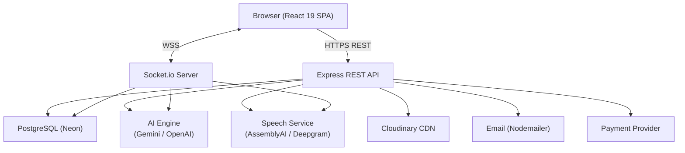
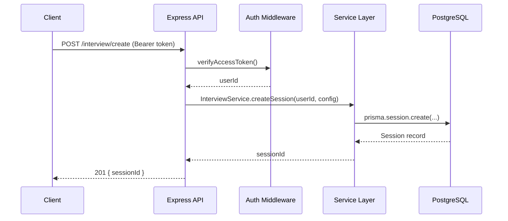
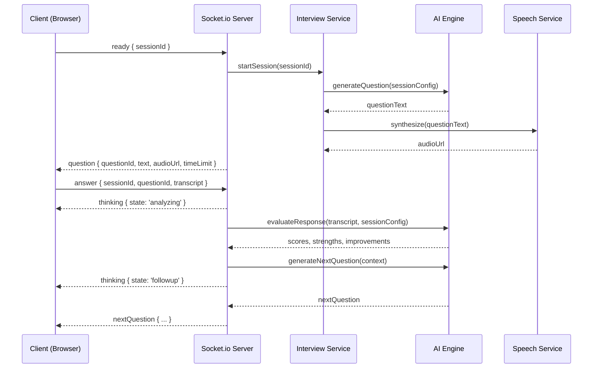

# Design Document: AI Interview Platform

## Overview

The AI Interview Platform (Apex.ai) is a full-stack, real-time application that simulates live technical and behavioral interviews. Users configure a session, go through a device-check lobby, then enter an interview room where a Socket.io-driven pipeline orchestrates AI-generated questions (via Gemini/OpenAI), real-time speech transcription (via AssemblyAI/Deepgram), and per-response AI evaluation. On completion a detailed report is asynchronously assembled, and aggregated analytics surface performance trends over time.

### High-Level Goals

- Realistic, low-latency interview experience driven by WebSocket real-time communication
- Modular AI and speech service layers that can be swapped between providers without touching business logic
- Secure, JWT-based auth with automatic token rotation and Google OAuth support
- Tiered subscription model (free / pro) with plan enforcement at the middleware level
- Full data ownership: users can export, share, and delete all their data

### Technology Summary

| Layer | Technology |
|-------|-----------|
| Frontend | React 19, Vite, TypeScript, Tailwind CSS, shadcn/ui, Zustand, TanStack Query, Framer Motion, Recharts |
| Backend | Node.js, Express, TypeScript, Prisma ORM |
| Database | PostgreSQL (Neon) |
| Real-time | Socket.io |
| AI | Google Gemini / OpenAI (interchangeable via adapter) |
| Speech | AssemblyAI / Deepgram (interchangeable via adapter) |
| Storage | Cloudinary |
| Auth | JWT (Access 15 min + Refresh 7 d), bcrypt, Google OAuth 2.0 |
| Deployment | Vercel (frontend), Railway/Render (backend), Neon (DB) |

---

## Architecture

### System Context Diagram




### Request Lifecycle



### Real-Time Interview Flow



---

## Components and Interfaces

### Frontend Component Tree

```
App
├── AuthLayout
│   ├── LoginPage
│   └── RegisterPage
└── AppLayout
    ├── LandingPage
    ├── DashboardPage
    ├── Interview/
    │   ├── LobbyPage
    │   ├── RoomPage
    │   └── ThinkingOverlay
    ├── ReportPage
    ├── HistoryPage
    ├── AnalyticsPage
    ├── SettingsPage
    └── ProfilePage
```

### Frontend Services (Axios)

```typescript
// services/authService.ts
interface AuthService {
  register(payload: RegisterDto): Promise<AuthResponse>;
  login(payload: LoginDto): Promise<AuthResponse>;
  logout(): Promise<void>;
  refreshToken(): Promise<AuthResponse>;
  forgotPassword(email: string): Promise<void>;
  resetPassword(token: string, password: string): Promise<void>;
}

// services/interviewService.ts
interface InterviewService {
  createSession(config: SessionConfig): Promise<{ sessionId: string }>;
  startSession(sessionId: string): Promise<void>;
  submitAnswer(payload: AnswerPayload): Promise<void>;
  endSession(sessionId: string): Promise<void>;
}

// services/reportService.ts
interface ReportService {
  getReport(sessionId: string): Promise<Report>;
  downloadPDF(reportId: string): Promise<Blob>;
  shareReport(reportId: string): Promise<{ shareUrl: string }>;
}
```

### Backend Service Interfaces

```typescript
// services/AuthService.ts
interface IAuthService {
  register(dto: RegisterDto): Promise<TokenPair>;
  login(dto: LoginDto): Promise<TokenPair>;
  logout(refreshToken: string): Promise<void>;
  refresh(refreshToken: string): Promise<TokenPair>;
  forgotPassword(email: string): Promise<void>;
  resetPassword(token: string, newPassword: string): Promise<void>;
  handleGoogleCallback(code: string): Promise<TokenPair>;
}

// services/InterviewService.ts
interface IInterviewService {
  createSession(userId: string, config: SessionConfig): Promise<Session>;
  startSession(sessionId: string): Promise<void>;
  recordResponse(payload: ResponsePayload): Promise<Response>;
  endSession(sessionId: string): Promise<void>;
  checkPlanLimits(userId: string): Promise<boolean>;
}

// services/AIEngine.ts
interface IAIEngine {
  generateQuestion(context: QuestionContext): Promise<Question>;
  evaluateResponse(transcript: string, context: EvalContext): Promise<Evaluation>;
  generateDashboardSuggestions(history: Session[]): Promise<string[]>;
}

// services/SpeechService.ts
interface ISpeechService {
  streamTranscription(audioStream: Readable, sessionId: string): EventEmitter;
  synthesize(text: string, voice: string): Promise<string>; // returns audioUrl
  finalizeTranscript(sessionId: string): Promise<string>;
}
```


### Socket.io Event Contract

```typescript
// socket/events.ts

// Server → Client
interface ServerToClientEvents {
  startInterview: (data: { sessionId: string; questionCount: number }) => void;
  question: (data: { questionId: string; text: string; audioUrl: string; orderIndex: number; timeLimit: number }) => void;
  thinking: (data: { state: 'analyzing' | 'followup' | 'feedback' }) => void;
  nextQuestion: (data: { questionId: string; text: string; audioUrl: string; orderIndex: number }) => void;
  report: (data: { reportId: string }) => void;
  error: (data: { message: string; code: string }) => void;
}

// Client → Server
interface ClientToServerEvents {
  ready: (data: { sessionId: string }) => void;
  answer: (data: { sessionId: string; questionId: string; transcript: string; durationSeconds: number }) => void;
  endInterview: (data: { sessionId: string }) => void;
}
```

### Zustand Store Slices

```typescript
// store/authSlice.ts
interface AuthSlice {
  user: User | null;
  accessToken: string | null;
  isAuthenticated: boolean;
  setUser: (user: User, token: string) => void;
  clearAuth: () => void;
}

// store/interviewSlice.ts
interface InterviewSlice {
  sessionId: string | null;
  currentQuestion: Question | null;
  transcript: string;
  thinkingState: 'analyzing' | 'followup' | 'feedback' | null;
  timer: number;
  setQuestion: (q: Question) => void;
  setThinking: (state: ThinkingState) => void;
  appendTranscript: (chunk: string) => void;
}
```

---

## Data Models

### Prisma Schema (Key Models)

```prisma
model User {
  id                  String          @id @default(cuid())
  email               String          @unique
  passwordHash        String?
  displayName         String
  photoUrl            String?
  college             String?
  yearsOfExperience   Int             @default(0)
  skills              String[]
  resumeUrl           String?
  planId              String          @default("free")
  googleId            String?         @unique
  notificationPrefs   Json            @default("{}")
  themePreference     String          @default("system")
  aiVoicePreference   String          @default("default")
  language            String          @default("en")
  createdAt           DateTime        @default(now())
  updatedAt           DateTime        @updatedAt
  sessions            Session[]
  refreshTokens       RefreshToken[]
  notifications       Notification[]
  activityLogs        ActivityLog[]
  payments            Payment[]
}

model Plan {
  id                    String  @id
  name                  String  @unique
  maxInterviewsPerDay   Int
  pdfExportEnabled      Boolean
  shareableLinksEnabled Boolean
}

model Session {
  id             String     @id @default(cuid())
  userId         String
  role           String
  experienceYears Int
  difficulty     Difficulty
  interviewType  InterviewType
  techStack      String[]
  language       String
  status         SessionStatus @default(configured)
  questionCount  Int           @default(8)
  createdAt      DateTime      @default(now())
  completedAt    DateTime?
  user           User          @relation(fields: [userId], references: [id])
  questions      Question[]
  responses      Response[]
  report         Report?
}

enum Difficulty    { Easy Medium Hard }
enum InterviewType { Technical Behavioral Mixed }
enum SessionStatus { configured active completed interrupted }

model Question {
  id         String    @id @default(cuid())
  sessionId  String
  text       String
  orderIndex Int
  createdAt  DateTime  @default(now())
  session    Session   @relation(fields: [sessionId], references: [id])
  response   Response?
}

model Response {
  id                   String   @id @default(cuid())
  sessionId            String
  questionId           String   @unique
  transcript           String
  audioUrl             String?
  durationSeconds      Int
  submittedAt          DateTime @default(now())
  technicalScore       Int
  communicationScore   Int
  problemSolvingScore  Int
  grammarScore         Int
  strengths            String[]
  improvements         String[]
  session              Session  @relation(fields: [sessionId], references: [id])
  question             Question @relation(fields: [questionId], references: [id])
}

model Report {
  id                  String   @id @default(cuid())
  sessionId           String   @unique
  overallScore        Int
  technicalScore      Int
  communicationScore  Int
  confidenceScore     Int
  grammarScore        Int
  problemSolvingScore Int
  strengths           String[]
  weaknesses          String[]
  suggestions         String[]
  shareToken          String?  @unique
  shareTokenExpiresAt DateTime?
  createdAt           DateTime @default(now())
  session             Session  @relation(fields: [sessionId], references: [id])
}

model RefreshToken {
  id        String    @id @default(cuid())
  userId    String
  token     String    @unique
  expiresAt DateTime
  revokedAt DateTime?
  user      User      @relation(fields: [userId], references: [id])
}

model Notification {
  id        String   @id @default(cuid())
  userId    String
  type      String
  message   String
  link      String?
  read      Boolean  @default(false)
  createdAt DateTime @default(now())
  user      User     @relation(fields: [userId], references: [id])
}

model Payment {
  id                String   @id @default(cuid())
  userId            String
  amount            Int
  currency          String
  provider          String
  providerPaymentId String
  status            String
  createdAt         DateTime @default(now())
  user              User     @relation(fields: [userId], references: [id])
}

model ActivityLog {
  id        String   @id @default(cuid())
  userId    String
  action    String
  metadata  Json     @default("{}")
  createdAt DateTime @default(now())
  user      User     @relation(fields: [userId], references: [id])
}
```


### Key TypeScript Types

```typescript
// types/index.ts

export type TokenPair = { accessToken: string; refreshToken: string };

export type SessionConfig = {
  role: string;
  experienceYears: number;
  difficulty: 'Easy' | 'Medium' | 'Hard';
  interviewType: 'Technical' | 'Behavioral' | 'Mixed';
  techStack: string[];
  language: string;
  questionCount?: number;
};

export type Evaluation = {
  technicalScore: number;       // 0–100
  communicationScore: number;   // 0–100
  problemSolvingScore: number;  // 0–100
  grammarScore: number;         // 0–100
  strengths: string[];
  improvements: string[];
};

export type TranscriptionResult = {
  sessionId: string;
  text: string;
  confidence: number;
  isFinal: boolean;
  timestamp: number;
};

export type ReportData = {
  sessionId: string;
  overallScore: number;
  technicalScore: number;
  communicationScore: number;
  confidenceScore: number;
  grammarScore: number;
  problemSolvingScore: number;
  strengths: string[];
  weaknesses: string[];
  suggestions: string[];
  timeline: Array<{ question: string; response: string; scores: Evaluation }>;
};
```

---

## Design Decisions and Rationale

### 1. JWT Rotation Strategy
Every call to `POST /auth/refresh` atomically revokes the incoming Refresh_Token and issues a fresh pair. This sliding-window approach limits the damage window if a token is stolen, and the server-side `revokedAt` field enables immediate invalidation on logout or password reset.

### 2. AI Provider Abstraction
Both `GeminiClient` and `OpenAIClient` implement `IAIEngine`. The active client is selected via an environment variable (`AI_PROVIDER=gemini|openai`). This isolates provider-specific SDK calls from business logic and allows cost-based or quota-based runtime switching.

### 3. Speech Streaming Architecture
Audio captured in the browser is chunked over the Socket.io connection (or a dedicated WebRTC channel). The `SpeechService` on the server pipes chunks to the provider's streaming SDK and re-emits incremental `transcriptChunk` events back to the client. The final transcript is sealed when the user submits or the timer expires.

### 4. Async Report Generation
Report generation is decoupled from the interview end event. When `Session.status` → `"completed"`, the `Interview_Service` enqueues a report job (or calls `ReportService.generate()` in a `setImmediate` callback). The client polls `GET /report/:id` or listens for the Socket `report` event. This prevents the `endInterview` acknowledgment from blocking on AI aggregation.

### 5. Plan Enforcement Middleware
`PlanGuard` middleware runs before `POST /interview/create`. It queries `Session` for the count of sessions created by the user in the last 24 hours and compares it against `Plan.maxInterviewsPerDay`. Free-tier users hitting the limit receive a `429` with an upgrade prompt.

### 6. Share Token Security
`crypto.randomBytes(32).toString('hex')` produces a 256-bit unguessable token stored in `Report.shareToken` with a 7-day TTL. The public `GET /shared/:token` endpoint looks up the token, checks `shareTokenExpiresAt > now()`, and returns the report without any auth header requirement.

### 7. Streak Computation
A nightly cron job (via `node-cron`) iterates over all users, checks the `completedAt` of their most recent session, and computes the streak. Streaks are stored as a derived value in a Redis counter or re-computed on dashboard request from the sorted session history. Broken streak notifications are dispatched by the `NotificationService`.

---


## Correctness Properties

*A property is a characteristic or behavior that should hold true across all valid executions of a system — essentially, a formal statement about what the system should do. Properties serve as the bridge between human-readable specifications and machine-verifiable correctness guarantees.*

---

### Property 1: Registration produces a valid token pair for any valid input

*For any* valid combination of email, password (≥ 8 characters), and display name, calling `register()` should return a non-empty `accessToken` and a non-empty `refreshToken`.

**Validates: Requirements 1.1**

---

### Property 2: Passwords shorter than the minimum are always rejected

*For any* password string of length 0–7 characters, submitting a registration request should return a 422 Unprocessable Entity response.

**Validates: Requirements 1.3**

---

### Property 3: Login produces a valid token pair for any registered user

*For any* user that has been successfully registered, calling `login()` with that user's correct credentials should return a non-empty `accessToken` and a non-empty `refreshToken`.

**Validates: Requirements 1.4**

---

### Property 4: Refresh token rotation always revokes the old token

*For any* user holding a valid Refresh_Token, calling `refresh()` should return a new token pair AND mark the original Refresh_Token as revoked, so that a second call with the same old token returns 401.

**Validates: Requirements 1.7, 1.8**

---

### Property 5: Logout always revokes the active Refresh_Token

*For any* authenticated user session, calling `logout()` should set `revokedAt` on the user's Refresh_Token such that any subsequent `refresh()` call with that token returns 401.

**Validates: Requirements 1.9**

---

### Property 6: Password reset invalidates all existing Refresh_Tokens

*For any* user with one or more active Refresh_Tokens, after a successful `resetPassword()` call, every previously issued Refresh_Token for that user should be revoked.

**Validates: Requirements 1.11**

---

### Property 7: Incomplete interview configuration is always rejected

*For any* interview creation request that omits at least one required field (role, difficulty, interviewType, techStack, language), the platform should prevent submission / return a validation error.

**Validates: Requirements 2.2**

---

### Property 8: Session creation round-trip

*For any* valid `SessionConfig`, calling `createSession()` should return a `sessionId`, and subsequently fetching that session should show `status = "configured"` with the exact configuration values that were submitted.

**Validates: Requirements 2.3**

---

### Property 9: Invalid enum values for difficulty and interviewType are always rejected

*For any* difficulty value not in `{"Easy","Medium","Hard"}` or any interviewType value not in `{"Technical","Behavioral","Mixed"}`, the `Interview_Service` should return a 422 error.

**Validates: Requirements 2.4, 2.5**

---

### Property 10: Free-plan session limit is enforced

*For any* free-plan user who has already created 5 sessions within the preceding 24-hour window, any further `createSession()` call during that window should be rejected (429 / plan-limit error).

**Validates: Requirements 2.6**

---

### Property 11: Low connection speed always triggers a warning

*For any* measured internet speed below 1 Mbps, the Lobby page should display the connection-quality warning indicator.

**Validates: Requirements 3.4**

---

### Property 12: Answer submission stores the exact transcript in the Response

*For any* non-empty transcript string submitted via the `answer` event, the persisted `Response.transcript` in the database should equal that exact string.

**Validates: Requirements 4.5**

---

### Property 13: Session completion sets status to "completed"

*For any* active session where all configured questions have been answered (or `endInterview` is emitted), the `Session.status` should transition to `"completed"`.

**Validates: Requirements 4.10**

---

### Property 14: Question count constraints are always enforced

*For any* `questionCount` value outside the range [3, 20], `createSession()` should return a 422 error. *For any* `questionCount` value in [3, 20], the created session should store that exact value.

**Validates: Requirements 4.13**

---

### Property 15: AI evaluation always produces valid scores and at least one strength and improvement

*For any* non-empty transcript string, `evaluateResponse()` should return:
- `technicalScore`, `communicationScore`, `problemSolvingScore`, and `grammarScore` each in the range [0, 100]
- `strengths.length ≥ 1`
- `improvements.length ≥ 1`

**Validates: Requirements 5.3, 5.4**

---

### Property 16: AI retry exhaustion returns 503 after exactly 3 attempts

*For any* AI API call where the external provider consistently returns an error, the `Interview_Service` should retry exactly 3 times (with exponential backoff) and then return a 503 Service Unavailable response — never more, never fewer retries.

**Validates: Requirements 5.7**

---

### Property 17: Transcription result serialization round-trip

*For any* valid `TranscriptionResult` object, serializing it to JSON and then deserializing it should produce an object that is deeply equal to the original.

**Validates: Requirements 6.6**

---

### Property 18: Transcription finalization stores the complete transcript

*For any* speech-to-text session, after `finalizeTranscript()` is called, the `Response.transcript` stored in the database should equal the complete, finalized transcript string.

**Validates: Requirements 6.2**

---

### Property 19: TTS synthesis always returns a non-empty audio URL

*For any* non-empty question text string, `Speech_Service.synthesize()` should return a non-empty URL string pointing to the synthesized audio.

**Validates: Requirements 6.4**

---

### Property 20: Low-confidence transcription always displays a clarification indicator

*For any* `TranscriptionResult` with `confidence < 0.6`, the Interview_Room UI component should render the low-confidence clarification indicator.

**Validates: Requirements 6.5**

---

### Property 21: Report generation produces all score components for any completed session

*For any* completed session with one or more responses, `Report_Service.generateReport()` should produce a `Report` record containing non-null values for all six score fields: `overallScore`, `technicalScore`, `communicationScore`, `confidenceScore`, `grammarScore`, `problemSolvingScore`.

**Validates: Requirements 7.1**

---

### Property 22: Overall score equals the arithmetic mean of per-response scores

*For any* list of per-response overall scores `[s₁, s₂, …, sₙ]`, the `Report.overallScore` should equal `Math.round((s₁ + s₂ + … + sₙ) / n)`.

**Validates: Requirements 7.6**

---

### Property 23: Share token is unique and expires in 7 days

*For any* report, calling `shareReport()` should return a token such that:
- The token does not match any previously issued token (uniqueness)
- `shareTokenExpiresAt` is approximately `now + 7 days` (within a 60-second tolerance)

**Validates: Requirements 7.5**

---

### Property 24: Dashboard always shows exactly the 5 most recent sessions in descending order

*For any* user with N ≥ 5 completed sessions, the dashboard response should contain exactly 5 sessions, and their `completedAt` timestamps should be in strictly descending order.

**Validates: Requirements 8.2**

---

### Property 25: Dashboard AI suggestions count is always between 1 and 3

*For any* user performance history, `getDashboardSuggestions()` should return a list of length ≥ 1 and ≤ 3.

**Validates: Requirements 8.3**

---

### Property 26: Date-range filter returns only sessions within the specified range

*For any* valid date range `[start, end]`, all sessions returned by the analytics filter should have `completedAt >= start` and `completedAt <= end`.

**Validates: Requirements 9.5**

---

### Property 27: Analytics aggregate counts are always accurate

*For any* set of N completed sessions across R unique roles, `getAnalytics()` should return `totalSessions = N` and `uniqueRoles = R`.

**Validates: Requirements 9.6**

---

### Property 28: History pagination returns correct page size in descending date order

*For any* user with N sessions, page 1 of the history endpoint should return `min(N, 20)` items, and consecutive items should have non-ascending `createdAt` timestamps.

**Validates: Requirements 10.1**

---

### Property 29: Role search always returns only matching sessions

*For any* search query string `q`, every session in the search results should satisfy `session.role.toLowerCase().includes(q.toLowerCase())`.

**Validates: Requirements 10.2**

---

### Property 30: Combined filters enforce all criteria simultaneously (AND logic)

*For any* combination of active filters (difficulty, interviewType, date range, score range), every session in the results should satisfy all active filter predicates at the same time.

**Validates: Requirements 10.3**

---

### Property 31: Session deletion cascades to all associated records

*For any* session that is deleted (with confirmation), none of its associated `Question`, `Response`, or `Report` records should remain retrievable from the database after deletion.

**Validates: Requirements 10.5**

---

### Property 32: Profile update round-trip

*For any* valid profile update payload, the response to `PUT /users/profile` should contain the updated field values, and a subsequent `GET /users/me` should return those same values.

**Validates: Requirements 11.1**

---

### Property 33: Profile photos larger than 5 MB are always rejected

*For any* file with byte size > 5,242,880 (5 MB), the photo upload endpoint should return a 413 error.

**Validates: Requirements 11.3**

---

### Property 34: Voice preference propagates to all subsequent TTS calls

*For any* voice preference string `v` set by the user, all subsequent calls to `Speech_Service.synthesize()` should include `v` as the voice parameter in the provider API request.

**Validates: Requirements 11.7**

---

### Property 35: Account deletion removes all user data

*For any* user with associated sessions, responses, reports, refresh tokens, and activity logs, after a successful `deleteAccount()` call, none of those records should remain in the database.

**Validates: Requirements 11.8**

---

### Property 36: Report-ready event always creates an in-app notification

*For any* completed session, the report-generation pipeline should create exactly one `Notification` record for the owning user containing a link to the new report.

**Validates: Requirements 12.1**

---

### Property 37: Marking a notification read decrements the unread count

*For any* user with an unread notification count of N, marking one notification as read should result in an unread count of N − 1.

**Validates: Requirements 12.4**

---

### Property 38: Valid payment webhook creates a Payment record and activates the plan

*For any* payment webhook request with a valid signature, the handler should create a `Payment` record and update the user's `planId` to `"pro"`.

**Validates: Requirements 13.3**

---

### Property 39: Invalid payment webhook never updates the user's plan

*For any* payment webhook request with an invalid or missing signature, the user's `planId` should remain unchanged after the request.

**Validates: Requirements 13.4**

---

### Property 40: All protected endpoints require a valid Access_Token

*For any* non-public REST API endpoint or Socket.io connection, a request made without a valid `Authorization` header / handshake token should receive a 401 Unauthorized response / connection rejection.

**Validates: Requirements 14.1, 14.7**

---

### Property 41: Cross-user data access is always forbidden

*For any* two distinct users A and B, any attempt by user B to read or modify a resource owned by user A should return a 403 Forbidden response.

**Validates: Requirements 7.3, 10.6, 14.2**

---

### Property 42: Stored passwords are never plaintext

*For any* password string submitted during registration or password reset, the value stored in `User.passwordHash` should not equal the plaintext password, and `bcrypt.compare(plaintext, hash)` should return `true`.

**Validates: Requirements 14.4**

---

### Property 43: Rate limiting rejects excess authentication requests

*For any* IP address that sends more than 100 authentication requests within a 60-second window, all requests beyond the 100th should receive a 429 Too Many Requests response.

**Validates: Requirements 14.5**

---

### Property 44: Unhandled server exceptions return 500 and the server remains operational

*For any* request to an endpoint whose handler throws an unexpected exception, the response should be 500 Internal Server Error, and the next request to a healthy endpoint should be processed successfully (server does not crash).

**Validates: Requirements 15.3**

---

### Property 45: Third-party service failures are surfaced gracefully without crashing

*For any* mocked unavailability of the AI_Engine, Speech_Service, or payment provider, the platform should return a structured error response (not an unhandled exception) and subsequent requests to unaffected endpoints should succeed.

**Validates: Requirements 15.5**

---


## Error Handling

### Strategy Overview

The platform uses a layered error-handling strategy:

1. **Validation errors** — caught by Zod validators at the request boundary; returned as 422 with a structured `errors` array.
2. **Authentication/authorization errors** — caught by auth middleware; returned as 401 or 403.
3. **Business logic errors** — thrown as typed `AppError` subclasses from service layer; mapped to appropriate HTTP status codes by a central error-handler middleware.
4. **External service errors** — wrapped by adapter classes (`GeminiClient`, `AssemblyAIClient`, etc.); transient errors trigger retry logic; permanent failures surface a 503 or 502.
5. **Unhandled exceptions** — caught by Express `errorHandler` middleware, logged with full stack trace, and returned as 500.

### Error Classes

```typescript
// utils/errors.ts
class AppError extends Error {
  constructor(public statusCode: number, public code: string, message: string) {
    super(message);
  }
}

class ValidationError extends AppError { /* 422 */ }
class UnauthorizedError extends AppError { /* 401 */ }
class ForbiddenError extends AppError { /* 403 */ }
class NotFoundError extends AppError { /* 404 */ }
class ConflictError extends AppError { /* 409 */ }
class PlanLimitError extends AppError { /* 429 */ }
class ServiceUnavailableError extends AppError { /* 503 */ }
```

### Express Error Handler

```typescript
// middlewares/errorHandler.ts
export function errorHandler(err: Error, req: Request, res: Response, next: NextFunction) {
  if (err instanceof AppError) {
    return res.status(err.statusCode).json({ error: err.code, message: err.message });
  }
  logger.error({ err, req: { method: req.method, url: req.url } });
  res.status(500).json({ error: 'INTERNAL_ERROR', message: 'An unexpected error occurred' });
}
```

### AI Retry with Exponential Backoff

```typescript
// utils/retry.ts
async function withRetry<T>(fn: () => Promise<T>, maxAttempts = 3): Promise<T> {
  for (let attempt = 1; attempt <= maxAttempts; attempt++) {
    try {
      return await fn();
    } catch (err) {
      if (attempt === maxAttempts) throw new ServiceUnavailableError(503, 'AI_UNAVAILABLE', 'AI service failed after retries');
      await sleep(Math.pow(2, attempt - 1) * 1000); // 1s, 2s, 4s
    }
  }
}
```

### WebSocket Error Handling

- Socket middleware validates token on `connection`; emits `error` event then `disconnect` on failure.
- Session-level errors (AI failure, speech failure) emit `error { message, code }` to the specific socket, not the entire namespace.
- Reconnection: Socket.io client configured with `reconnectionAttempts: 5, reconnectionDelay: 2000`. Server marks session `"interrupted"` if no reconnect within 30 seconds.

### Graceful Degradation

| Service | Failure Mode | User-Facing Behavior |
|---------|-------------|---------------------|
| AI Engine | API error after retries | Toast: "AI service temporarily unavailable. Please try again." — session can be retried |
| Speech STT | Provider error | Fallback to manual text input in the interview room |
| Speech TTS | Synthesis error | Question displayed as text only; no audio playback |
| Cloudinary | Upload failure | Profile photo update fails with user-visible error; existing photo unchanged |
| Payment Provider | Webhook failure | Payment recorded as pending; job retries for 24 hours |
| Database | Connection lost | 503 returned; connection pool retries automatically |

---

## Testing Strategy

### Philosophy

Two complementary layers:
- **Property-based tests** — verify universal invariants across a wide, randomly generated input space (100+ iterations each). These catch edge cases that hand-crafted examples miss.
- **Unit/example tests** — verify specific scenarios, integration points, UI states, and error conditions with concrete inputs.

### Property-Based Testing

**Library choice:** [fast-check](https://github.com/dubzzz/fast-check) (TypeScript-native, excellent arbitrary generators, shrinking support).

**Configuration:**
```typescript
// vitest.config.ts
import { defineConfig } from 'vitest/config';
export default defineConfig({
  test: {
    globals: true,
    environment: 'node', // 'jsdom' for frontend tests
  },
});

// Each property test runs 100+ iterations:
fc.assert(fc.property(arb, (input) => { ... }), { numRuns: 100 });
```

**Tag format for traceability:**
```typescript
// Feature: ai-interview-platform, Property 15: AI evaluation always produces valid scores
it('[P15] evaluateResponse produces valid scores and feedback', async () => { ... });
```

**Properties to implement (mapped to design properties above):**

| Property # | Test File | Arbitrary Inputs |
|-----------|-----------|-----------------|
| P1 | `auth.property.test.ts` | `fc.record({ email: fc.emailAddress(), password: fc.string({ minLength: 8 }), displayName: fc.string({ minLength: 1 }) })` |
| P2 | `auth.property.test.ts` | `fc.string({ maxLength: 7 })` |
| P3 | `auth.property.test.ts` | Registered user + correct credentials |
| P4 | `auth.property.test.ts` | Valid refresh token per user |
| P5 | `auth.property.test.ts` | Any authenticated session |
| P6 | `auth.property.test.ts` | User with N active refresh tokens |
| P7 | `interview.property.test.ts` | `fc.record(...)` with random field omissions |
| P8 | `interview.property.test.ts` | Valid `fc.record` of SessionConfig |
| P9 | `interview.property.test.ts` | `fc.string()` filtered to invalid enum values |
| P10 | `interview.property.test.ts` | Free user with session count [5..20] |
| P11 | `lobby.property.test.ts` | `fc.float({ max: 0.99 })` as Mbps reading |
| P12 | `interview.property.test.ts` | `fc.string({ minLength: 1 })` as transcript |
| P13 | `interview.property.test.ts` | Any session with all questions answered |
| P14 | `interview.property.test.ts` | `fc.integer()` filtered outside [3,20] and within [3,20] |
| P15 | `ai.property.test.ts` | `fc.string({ minLength: 1 })` as transcript |
| P16 | `ai.property.test.ts` | Mocked AI always throws |
| P17 | `speech.property.test.ts` | `fc.record` of TranscriptionResult |
| P18 | `speech.property.test.ts` | Any transcript session |
| P19 | `speech.property.test.ts` | `fc.string({ minLength: 1 })` as question text |
| P20 | `speech.property.test.ts` | `fc.float({ max: 0.599 })` as confidence |
| P21 | `report.property.test.ts` | Session with N >= 1 responses |
| P22 | `report.property.test.ts` | `fc.array(fc.integer({ min: 0, max: 100 }), { minLength: 1 })` |
| P23 | `report.property.test.ts` | Any report |
| P24 | `dashboard.property.test.ts` | N >= 5 completed sessions |
| P25 | `dashboard.property.test.ts` | Any user history |
| P26 | `analytics.property.test.ts` | Valid date range pairs |
| P27 | `analytics.property.test.ts` | N sessions across R roles |
| P28 | `history.property.test.ts` | N sessions |
| P29 | `history.property.test.ts` | `fc.string()` as search query |
| P30 | `history.property.test.ts` | Random filter combinations |
| P31 | `history.property.test.ts` | Session with associated records |
| P32 | `profile.property.test.ts` | Valid profile update payloads |
| P33 | `profile.property.test.ts` | `fc.integer({ min: 5_242_881 })` as file size |
| P34 | `speech.property.test.ts` | Any voice preference string |
| P35 | `profile.property.test.ts` | User with all associated data |
| P36 | `notifications.property.test.ts` | Any completed session |
| P37 | `notifications.property.test.ts` | User with N >= 1 unread notifications |
| P38 | `payments.property.test.ts` | Valid webhook payload |
| P39 | `payments.property.test.ts` | Invalid/tampered webhook payload |
| P40 | `auth.property.test.ts` | Any protected endpoint + missing/invalid token |
| P41 | `auth.property.test.ts` | Two distinct users + any resource |
| P42 | `auth.property.test.ts` | Any password string |
| P43 | `auth.property.test.ts` | Simulated request burst > 100/min |
| P44 | `server.property.test.ts` | Any endpoint that throws |
| P45 | `resilience.property.test.ts` | Mocked third-party failures |

### Unit / Example Tests

Organized by layer:

**Backend (Vitest + Supertest):**
- `auth.test.ts` — register, login, OAuth, token lifecycle edge cases
- `interview.test.ts` — session CRUD, plan enforcement
- `report.test.ts` — score aggregation, PDF generation, share link
- `analytics.test.ts` — grouped queries, filter logic
- `notifications.test.ts` — event triggers, read/unread state
- `payments.test.ts` — webhook handling, plan state machine
- `socket.test.ts` — event handling, reconnection, auth rejection

**Frontend (Vitest + React Testing Library):**
- `LobbyPage.test.tsx` — permission states, speed check UI
- `InterviewRoom.test.tsx` — timer, transcript display, controls, thinking states
- `ReportPage.test.tsx` — score display, share, PDF download
- `DashboardPage.test.tsx` — stats, recent sessions, Quick Start
- `AnalyticsPage.test.tsx` — chart rendering, filter interaction
- `HistoryPage.test.tsx` — search, pagination, delete flow

### Integration Tests

- Full interview session flow (create → lobby → room → report) against a test database
- Google OAuth callback with mocked Google token endpoint
- Cloudinary upload with mocked SDK
- Payment webhook processing end-to-end
- Socket.io reconnection behavior

### Test File Organization

```
server/src/
  __tests__/
    unit/
      auth.test.ts
      interview.test.ts
      report.test.ts
      ...
    property/
      auth.property.test.ts
      interview.property.test.ts
      ai.property.test.ts
      speech.property.test.ts
      report.property.test.ts
      analytics.property.test.ts
      history.property.test.ts
      dashboard.property.test.ts
      profile.property.test.ts
      notifications.property.test.ts
      payments.property.test.ts
      server.property.test.ts
      resilience.property.test.ts
    integration/
      session-flow.integration.test.ts
      socket.integration.test.ts
      payments.integration.test.ts

client/src/
  __tests__/
    LobbyPage.test.tsx
    InterviewRoom.test.tsx
    ReportPage.test.tsx
    DashboardPage.test.tsx
    AnalyticsPage.test.tsx
    HistoryPage.test.tsx
```

